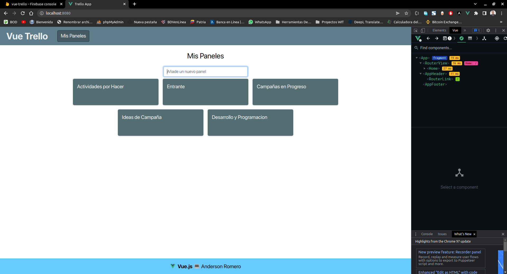
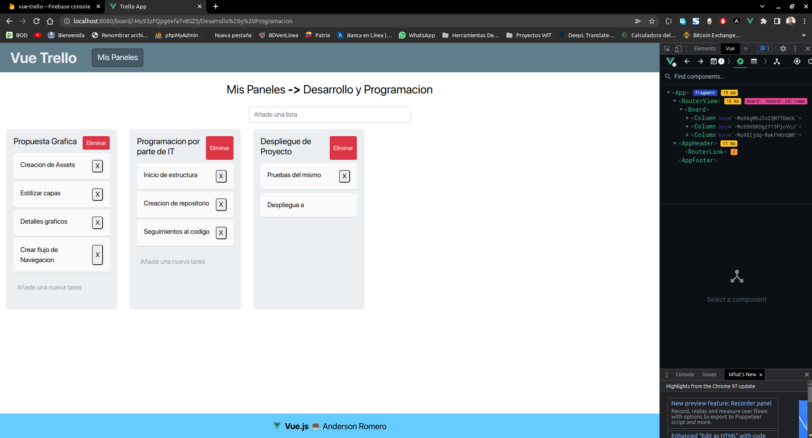
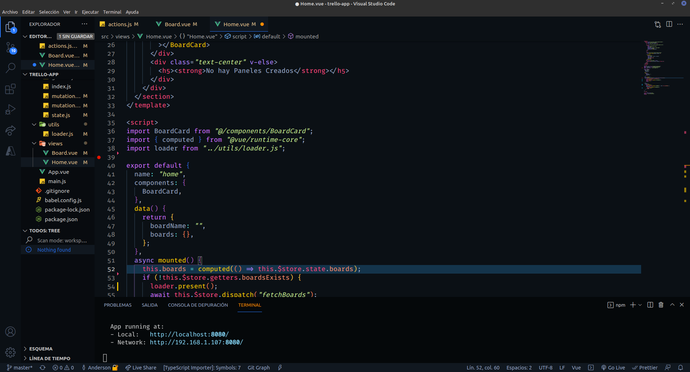
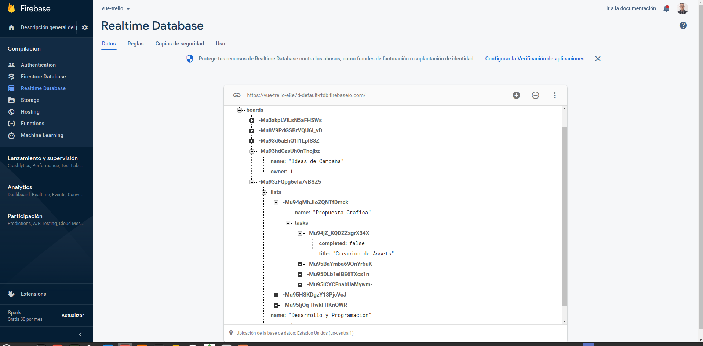
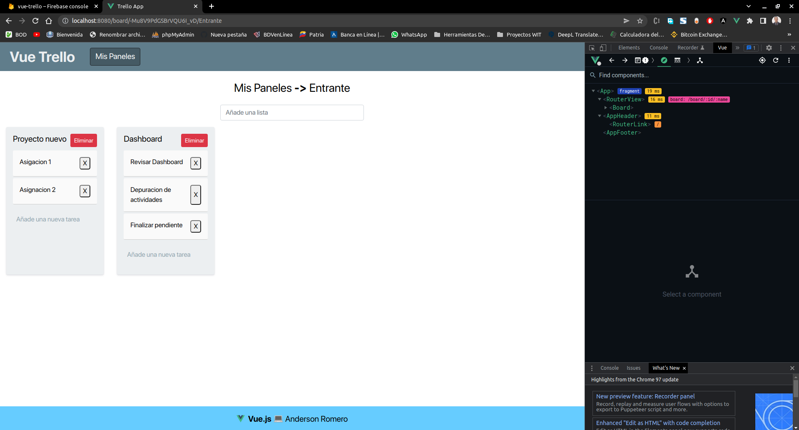
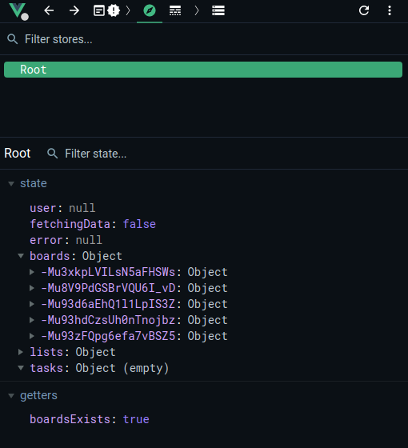

# trello-app

Trello application made with Vue 3 structured with Bootstrap 5, Axios was used for Https requests, the plugins used was Vuex to manage the state of the application and the Vue Router for the creation of routes. Finally we used Firebase Realtime Database with real time data update, with this project we understood the reactivity that Vue has and the relevance of using Vuex in a project for data management becoming almost like a standard.








## Project setup

```
npm install
```

### Compiles and hot-reloads for development

```
npm run serve
```

### Compiles and minifies for production

```
npm run build
```

### Lints and fixes files

```
npm run lint
```

### Customize configuration

See [Configuration Reference](https://cli.vuejs.org/config/).
